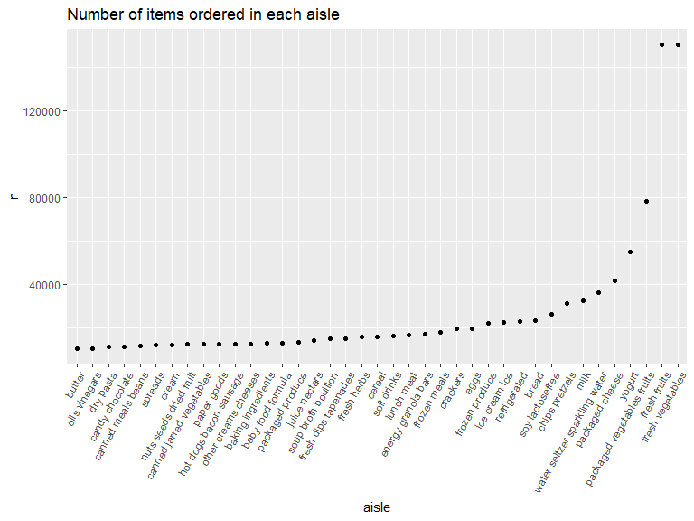
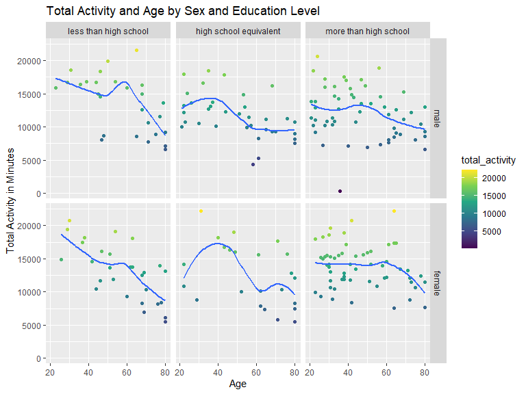
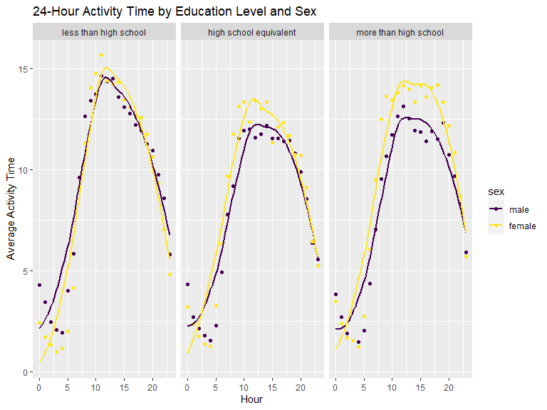

p8105_hw3_mgw2144
================
2023-10-11

``` r
library(tidyverse)
```

    ## ── Attaching core tidyverse packages ──────────────────────── tidyverse 2.0.0 ──
    ## ✔ dplyr     1.1.3     ✔ readr     2.1.4
    ## ✔ forcats   1.0.0     ✔ stringr   1.5.0
    ## ✔ ggplot2   3.4.3     ✔ tibble    3.2.1
    ## ✔ lubridate 1.9.2     ✔ tidyr     1.3.0
    ## ✔ purrr     1.0.2     
    ## ── Conflicts ────────────────────────────────────────── tidyverse_conflicts() ──
    ## ✖ dplyr::filter() masks stats::filter()
    ## ✖ dplyr::lag()    masks stats::lag()
    ## ℹ Use the conflicted package (<http://conflicted.r-lib.org/>) to force all conflicts to become errors

``` r
library(ggridges)
library(patchwork)
library(p8105.datasets)
library(here)
```

    ## here() starts at C:/Users/magno/Desktop/p8105_hw3_mgw2144

``` r
rm(list=ls())
project.folder=
  paste0(print(here::here()),'/')
```

    ## [1] "C:/Users/magno/Desktop/p8105_hw3_mgw2144"

``` r
knitr::opts_chunk$set(
  fig.width = 8,
  fig.height = 6,
  out.width = "90%"
)

options(
  ggplot2.continuous.colour = "viridis",
  ggplot2.continuous.fill = ("viridis"))

scale_colour_discrete = scale_colour_viridis_d
scale_fill_discrete = scale_fill_viridis_d
```

## Problem 1

``` r
data("instacart")

instacart = 
  instacart %>%
  as_tibble()
```

This dataset contains 1384617 rows and 15 columns, with each row
resprenting a single product from an instacart order. Variables include
identifiers for user, order, and product; the order in which each
product was added to the cart. There are several order-level variables,
describing the day and time of the order, and number of days since prior
order. Then there are several item-specific variables, describing the
product name (e.g. Yogurt, Avocado), department (e.g. dairy and eggs,
produce), and aisle (e.g. yogurt, fresh fruits), and whether the item
has been ordered by this user in the past. In total, there are 39123
products found in 131209 orders from 131209 distinct users.

Below is a table summarizing the number of items ordered from aisle. In
total, there are 134 aisles, with fresh vegetables and fresh fruits
holding the most items ordered by far.

``` r
instacart %>%  
  count(aisle) %>%  
  arrange(desc(n))
```

    ## # A tibble: 134 × 2
    ##    aisle                              n
    ##    <chr>                          <int>
    ##  1 fresh vegetables              150609
    ##  2 fresh fruits                  150473
    ##  3 packaged vegetables fruits     78493
    ##  4 yogurt                         55240
    ##  5 packaged cheese                41699
    ##  6 water seltzer sparkling water  36617
    ##  7 milk                           32644
    ##  8 chips pretzels                 31269
    ##  9 soy lactosefree                26240
    ## 10 bread                          23635
    ## # ℹ 124 more rows

Next is a plot that shows the number of items ordered in each aisle.
Here, aisles are ordered by ascending number of items.

``` r
instacart %>%  
  count(aisle) %>% 
  filter(n > 10000) %>% 
  mutate(aisle = fct_reorder(aisle, n)) %>% 
  ggplot(aes(x = aisle, y = n)) + 
  geom_point() + 
  labs(title = "Number of items ordered in each aisle") +
  theme(axis.text.x = element_text(angle = 60, hjust = 1))
```


Our next table shows the three most popular items in aisles
`baking ingredients`, `dog food care`, and `packaged vegetables fruits`,
and includes the number of times each item is ordered in your table.

``` r
instacart %>% 
  filter(aisle %in% c("baking ingredients", "dog food care", "packaged vegetables fruits")) %>% 
  group_by(aisle) %>% 
  count(product_name) %>%  
  mutate(rank = min_rank(desc(n))) %>% 
  filter(rank < 4) %>%  
  arrange(desc(n)) %>% 
  knitr::kable()
```

| aisle                      | product_name                                  |    n | rank |
|:---------------------------|:----------------------------------------------|-----:|-----:|
| packaged vegetables fruits | Organic Baby Spinach                          | 9784 |    1 |
| packaged vegetables fruits | Organic Raspberries                           | 5546 |    2 |
| packaged vegetables fruits | Organic Blueberries                           | 4966 |    3 |
| baking ingredients         | Light Brown Sugar                             |  499 |    1 |
| baking ingredients         | Pure Baking Soda                              |  387 |    2 |
| baking ingredients         | Cane Sugar                                    |  336 |    3 |
| dog food care              | Snack Sticks Chicken & Rice Recipe Dog Treats |   30 |    1 |
| dog food care              | Organix Chicken & Brown Rice Recipe           |   28 |    2 |
| dog food care              | Small Dog Biscuits                            |   26 |    3 |

Finally is a table showing the mean hour of the day at which Pink Lady
Apples and Coffee Ice Cream are ordered on each day of the week. This
table has been formatted in an untidy manner for human readers. Pink
Lady Apples are generally purchased slightly earlier in the day than
Coffee Ice Cream, with the exception of day 5.

``` r
instacart %>% 
  filter(product_name %in% c("Pink Lady Apples", "Coffee Ice Cream")) %>% 
  group_by(product_name, order_dow) %>% 
  summarize(mean_hour = mean(order_hour_of_day)) %>% 
  pivot_wider(
    names_from = order_dow, 
    values_from = mean_hour) %>% 
  knitr::kable(digits = 2)
```

    ## `summarise()` has grouped output by 'product_name'. You can override using the
    ## `.groups` argument.

| product_name     |     0 |     1 |     2 |     3 |     4 |     5 |     6 |
|:-----------------|------:|------:|------:|------:|------:|------:|------:|
| Coffee Ice Cream | 13.77 | 14.32 | 15.38 | 15.32 | 15.22 | 12.26 | 13.83 |
| Pink Lady Apples | 13.44 | 11.36 | 11.70 | 14.25 | 11.55 | 12.78 | 11.94 |

## Problem 2

``` r
data("brfss_smart2010")

brfss_smart2010_df = 
  brfss_smart2010 %>% 
  janitor::clean_names() %>% 
  rename(
    state = locationabbr,
    state_county = locationdesc
  ) %>% 
  filter(topic == "Overall Health") %>% 
  filter(response %in% c("Excellent", "Very good", "Good", "Fair", "Poor")) %>% 
  mutate(
    response = factor(response, levels = c("Poor", "Fair", "Good", "Very good", "Excellent"), ordered = TRUE)) %>% 
  arrange(response)
```

Data was cleaned to re-format some variable names and clean the column
names, focus on the “Overall Health” topic, include only participants
whose answers ranged from “Excellent” to “Poor”, and so that the
responses were organized from “Poor” to “Excellent”.

``` r
brfss_2002 = 
  brfss_smart2010_df %>% 
  filter(year == "2002") %>% 
  count(state) %>% 
  filter(n >= 7)

brfss_2010 = 
  brfss_smart2010_df %>% 
  filter(year == "2010")%>% 
  count(state) %>% 
  filter(n >= 7)
```

In 2002, 21 states were observed at 7 or more locations including: CT,
DE FL, ID, IL, IN, MA, MD, MI, NE, NH, NJ, NV, NY, OH, OK, PA, RI, SC,
UT, and WA.

In 2010, 38 states were observed at 7 or more locations including: AL,
AR, AZ, CA, CO, DE FL, ID, IN, KS, LA, MA, MD, ME, MI, MN, MO, MT, NC,
NE, NH, NJ, NM, NV, NY, OH, OK, OR, PA, RI, SC, SD, TN, TX, UT, VT, WA,
and WY.

``` r
brfss_exc = 
  brfss_smart2010_df %>% 
  filter(response == "Excellent") %>% 
  select(year, state, response, data_value) %>% 
  group_by(year, state) %>% 
  summarise(mean_dv = mean(data_value, na.rm = TRUE)) %>% 
  ggplot(aes(x = year, y = mean_dv, color = state)) +
    geom_point() + 
    geom_line() +
    labs(
      title = "Average Data Value Per State 2002-2010",
      x = "Year",
      y = "Average Data Value"
    )
```

    ## `summarise()` has grouped output by 'year'. You can override using the
    ## `.groups` argument.

``` r
brfss_exc
```


The result of this code is a “spaghetti” plot with one line for each
state in the data set as is represented by the state abbreviation. Each
data point connected by lines represents the average data value in
percent for each year by state. The average data value is represented by
the y-axis and the range of the graph on the y-axis is 10%-35%. Year is
represented on the x-axis with a range of 2002-2010.

``` r
brfss_two = 
 brfss_smart2010_df%>% 
  filter(
    state == "NY", year %in% c(2006, 2010)) %>% 
  mutate(
    state_county = sub(" County", "", state_county),
    state_county = sub("NY - ", "", state_county)
  ) %>% 
ggplot(aes(x = response, y = data_value, fill = response))+
  geom_bar(stat = "identity")+
  facet_grid(state_county~year)+
  labs(
    x = "Response",
    y = "Average Data Value (%)",
    title = "Average Data Value For New York Counties in 2006 and 2010 by Response Type"
  )

brfss_two
```


## description

## Problem 3

``` r
nhanes_accel =
  read_csv("C:/Users/magno/Desktop/p8105_hw3_mgw2144/data/nhanes_accel.csv") %>% 
  janitor::clean_names()
```

    ## Rows: 250 Columns: 1441
    ## ── Column specification ────────────────────────────────────────────────────────
    ## Delimiter: ","
    ## dbl (1441): SEQN, min1, min2, min3, min4, min5, min6, min7, min8, min9, min1...
    ## 
    ## ℹ Use `spec()` to retrieve the full column specification for this data.
    ## ℹ Specify the column types or set `show_col_types = FALSE` to quiet this message.

``` r
nhanes_covar =
  read_csv("C:/Users/magno/Desktop/p8105_hw3_mgw2144/data/nhanes_covar.csv", skip = 4) %>% 
  janitor::clean_names() %>% 
  drop_na()
```

    ## Rows: 250 Columns: 5
    ## ── Column specification ────────────────────────────────────────────────────────
    ## Delimiter: ","
    ## dbl (5): SEQN, sex, age, BMI, education
    ## 
    ## ℹ Use `spec()` to retrieve the full column specification for this data.
    ## ℹ Specify the column types or set `show_col_types = FALSE` to quiet this message.

``` r
nhanes = 
  nhanes_accel %>% 
  inner_join(nhanes_covar, by = "seqn") %>% 
  relocate(seqn, sex, age, bmi, education) %>% 
  filter(age >= 21) %>% 
  mutate(
    sex = case_when(
      sex == 1 ~ "male",
      sex == 2 ~ "female"),
    education = case_when(
      education == 1 ~ "less than high school",
      education == 2 ~ "high school equivalent",
      education == 3 ~ "more than high school")) %>% 
  mutate(
    sex = forcats::fct_relevel(sex, "male", "female"),
    education = forcats::fct_relevel(education, "less than high school", "high school equivalent", "more than high school")
  )
```

``` r
sex_education = 
  nhanes %>% 
  select(sex, education) %>% 
  group_by(sex, education) %>% 
  summarize(count = n()) 
```

    ## `summarise()` has grouped output by 'sex'. You can override using the `.groups`
    ## argument.

``` r
sex_education
```

    ## # A tibble: 6 × 3
    ## # Groups:   sex [2]
    ##   sex    education              count
    ##   <fct>  <fct>                  <int>
    ## 1 male   less than high school     27
    ## 2 male   high school equivalent    35
    ## 3 male   more than high school     56
    ## 4 female less than high school     28
    ## 5 female high school equivalent    23
    ## 6 female more than high school     59

``` r
sex_age_education = 
  nhanes %>% 
  select(sex, education, age) %>% 
  ggplot(aes(x = age, fill = sex))+
  geom_histogram(position = "dodge", binwidth = 5) +
  facet_grid(sex~education) +
  labs(title = "Age Distribution by Sex and Education Level", x = "Age", y = "Count") 

sex_age_education
```


## comment on these

``` r
nhanes_act_total =
  nhanes %>% 
  rowwise() %>% 
  mutate(
    total_activity = sum(c_across(min1:min1440)) %>% 
    as.numeric())

total_act_plot = 
  nhanes_act_total %>% 
  ggplot(aes(x = age, y = total_activity, color = total_activity)) +
  geom_point() +
  geom_smooth(se = FALSE) +
  facet_grid(sex~education) +
  labs(title = "Total Activity and Age by Sex and Education Level", x = "Age", y = "Total Activity in Minutes")

total_act_plot
```

    ## `geom_smooth()` using method = 'loess' and formula = 'y ~ x'


\## Comment on your plot

``` r
nhanes_hour <- nhanes %>%
  pivot_longer(cols = starts_with("min"), names_to = "minute", values_to = "activity") %>%
  mutate(
    minute = as.numeric(gsub("min", "", minute)),  
    hour = (minute - 1) %/% 60) %>%
  group_by(education, sex, hour) %>%
  summarize(mean_activity = mean(activity)) 
```

    ## `summarise()` has grouped output by 'education', 'sex'. You can override using
    ## the `.groups` argument.

``` r
day_plot = 
  nhanes_hour %>% 
  ggplot(aes(x = hour, y = mean_activity, color = sex)) +
  geom_point() +
  geom_smooth(se = FALSE) +
  facet_grid(.~education) +
  labs(
    title = "24-Hour Activity Time by Education Level and Sex", x = "Hour", y = "Average Activity Time")

day_plot
```

    ## `geom_smooth()` using method = 'loess' and formula = 'y ~ x'


\## describe

Describe in words any patterns or conclusions you can make based on this
graph; including smooth trends may help identify differences.
